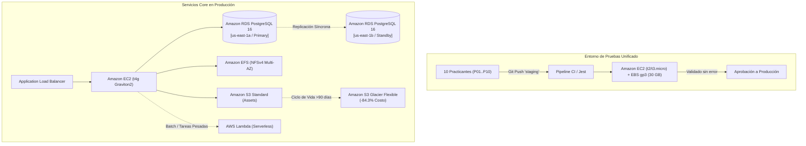
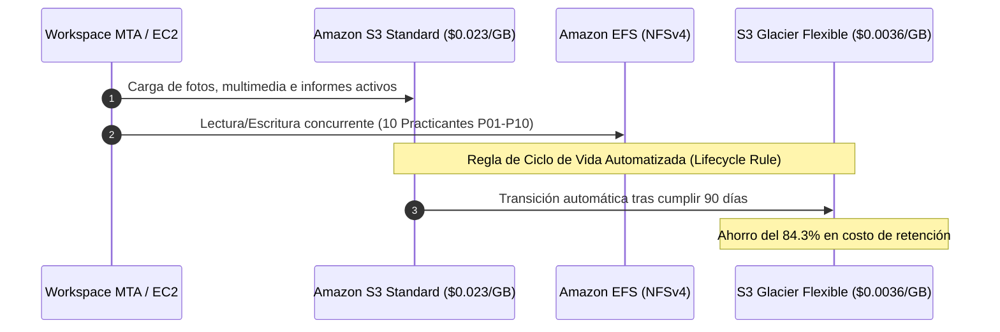
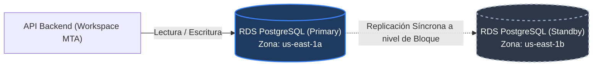

# Proyecto Cloud AWS — MTA Software
## Etapa 2: Aprovisionamiento de Servicios Core, Almacenamiento y Bases de Datos
> **Semana 7** | SENATI — Dirección Zonal Lima Callao | Escuela de Tecnologías de la Información

---

### Insignias de Estado & Gobernanza


---

## 1. Visión General de la Etapa 2

La **Etapa 2 (Semana 7)** traslada el diagnóstico situacional y los fundamentos perimetrales estructurados en la Etapa 1 hacia el **aprovisionamiento real en consola de AWS**. El objetivo es resolver los cuellos de botella del hosting tradicional compartido de **MTA Software** (Workspace MTA, 14 colaboradores y 10 practicantes remotos P01-P10).



---

## 2. Los 4 Pilares de Infraestructura

### Pilar 1: Entorno de Staging Unificado (Pre-producción)

> [!IMPORTANT]
> **Problema Resuelto**: Se elimina definitivamente la discrepancia de entornos locales (*"en mi máquina sí funciona"*). Los 10 practicantes ahora prueban contra una réplica exacta de producción en la nube.

- **Servicio Principal**: `Amazon EC2` + `Amazon EBS gp3`
- **Tipo de Instancia**: `t2.micro` / `t3.micro` (Free Tier: 750 horas/mes gratuitas)
- **Especificaciones**: 1–2 vCPUs burstable con créditos de CPU, 1 GiB RAM
- **Almacenamiento**: Volumen de 30 GB EBS gp3 (3,000 IOPS base, 125 MB/s de throughput continuo)
- **Pipeline Operativo**:
  1. `git push origin staging`
  2. Ejecución automatizada de pruebas unitarias (`Jest` + `Supertest`)
  3. Despliegue automático en la instancia Staging de EC2
  4. Revisión y validación por Tech Lead / QA
  5. Merge seguro a `main` (Producción)

---

### Pilar 2: Cómputo Elástico y Serverless

Para balancear cargas continuas y tareas asíncronas con eficiencia de costos:


| Tecnología | Rol en MTA Software | Ventaja Clave | Modelo de Costo |
| :--- | :--- | :--- | :--- |
| **Amazon EC2 (t4g.small)** | Backend Node.js / Express y APIs REST continuas | Procesadores ARM Graviton2 (+40% precio/rendimiento vs x86) | Cubierto por Free Tier / On-Demand |
| **AWS Lambda** | Cálculo de notas masivas, liquidaciones y PDFs batch | Ejecución orientada a eventos con timeout de hasta 15 min | **$0.00 en reposo** (1M peticiones/mes gratis) |
| **Amazon ECS / Docker** | Contenedores modulares de Workspace MTA | Despliegues *zero-downtime* sin romper dependencias | Orquestación nativa en clúster |

---

### Pilar 3: Estrategia de Almacenamiento Unificado y Archivo




- **Amazon S3 Standard**: 11 nueves de durabilidad (99.999999999%) para activos multimedia de Strato Studio, VIISION y Workspace MTA.
- **Amazon EFS (NFSv4)**: Sistema de archivos elástico compartido y montable concurrentemente por los 10 practicantes a través de subredes Multi-AZ.
- **Amazon S3 Glacier Flexible Retrieval**: Política de retención que migra respaldos a los 90 días reduciendo el almacenamiento de **$0.023/GB a solo $0.0036/GB** (**ahorro del 84.3%**).

---

### Pilar 4: Bases de Datos Administradas (Alta Disponibilidad Multi-AZ)

> [!WARNING]
> **Vulnerabilidad Crítica Resuelta**: En el hosting compartido anterior, la caída de un servidor causaba la interrupción total de Workspace MTA y riesgo de pérdida de datos. Con RDS Multi-AZ, el tiempo de inactividad ante fallas de hardware es inferior a 2 minutos sin intervención humana.




#### Parámetros Técnicos de RDS PostgreSQL:
- **Versión de Motor**: PostgreSQL 16
- **Instancia Base**: `db.t3.micro` / `db.t4g.micro` con 20 GB de almacenamiento SSD
- **Esquema de Resiliencia**:
  - Instancia Principal (*Primary*) en Subred Privada A (`us-east-1a`).
  - Réplica en Espera (*Standby*) en Subred Privada B (`us-east-1b`).
- **Métricas de Tolerancia a Fallos**:
  - **RPO (Recovery Point Objective)**: **0** (cero pérdida de transacciones confirmadas gracias a la replicación síncrona).
  - **RTO (Recovery Time Objective)**: **< 60-120 segundos** (failover de DNS totalmente automatizado).
- **Copias de Seguridad**: Snapshots diarios automáticos con retención de 7 días y *Point-In-Time Restore* (PITR) a nivel de segundo.

---

## 3. Matriz de Cobertura con los 10 Practicantes Remotos

| ID Practicante | Módulo Asignado | Servicio AWS Asignado | Beneficio Operativo Inmediato |
| :---: | :--- | :--- | :--- |
| **P01 - P02** | Control de Asistencias & Biometría | Amazon EC2 + Lambda | Cómputo serverless sin saturar el servidor web central. |
| **P03 - P04** | Registro Académico & Cálculo de Notas | AWS Lambda Batch | Procesamiento asíncrono en picos bimestrales a costo $0. |
| **P05 - P06** | Contratos & Documentación Digital | Amazon S3 + Glacier | Custodia segura con cifrado SSE-AES256 y archivado económico. |
| **P07 - P08** | Proyectos Multimedia (Strato Studio) | Amazon EFS + CloudFront | Espacio de disco concurrente y entrega CDN de baja latencia. |
| **P09 - P10** | QA, Pruebas Automatizadas y CI/CD | Amazon EC2 Staging + EBS | Ambiente de pruebas homogéneo y predecible. |

---

## 4. Presupuesto y Gobernanza Financiera

> [!TIP]
> **Estrategia Financiera**: El 100% del prototipo y entorno de Staging opera dentro de la capa gratuita (**AWS Free Tier de 12 meses**), respaldado por alarmas de gobernanza.

- **AWS Free Tier Asignado**:
  - `750 hrs/mes` de Amazon EC2 t2/t3.micro
  - `750 hrs/mes` de Amazon RDS PostgreSQL db.t3.micro
  - `30 GB` de volumen Amazon EBS gp3
  - `20 GB` de almacenamiento de base de datos SSD
  - `5 GB` de almacenamiento estándar en Amazon S3
  - `1,000,000` de llamadas mensuales en AWS Lambda
- **Gobernanza Proactiva**:
  - Alarma en **AWS Budgets** con límite estricto de **$10.00 USD**.
  - Notificación automática por Amazon SNS al alcanzar el 85% ($8.50 USD).
  - Métricas CloudWatch en tiempo real sobre consumo de créditos CPU e IOPS.

---

## 5. Resumen de Slides en la Presentación

```text
Slide 13 ──> Introducción Etapa 2 (Los 3 Pilares)
Slide 14 ──> Entorno de Staging Unificado (EC2 + EBS gp3)
Slide 15 ──> Cómputo Elástico y Serverless (EC2 Graviton2 + Lambda)
Slide 16 ──> Almacenamiento Unificado y Archivo (S3 + EFS + Glacier)
Slide 17 ──> Bases de Datos Administradas (RDS PostgreSQL Multi-AZ)
Slide 18 ──> Cierre Final y Sesión de Preguntas
```

---
*Documentación generada para el equipo técnico y directivo de MTA Software y SENATI.*
