# Propuesta Arquitectural y Plan de Slides — Etapa 3 (Semana 8)
## Modernización Integral en AWS: Arquitectura Dinámica, Resiliencia, Seguridad en Capas, Monitoreo y Despliegue Automatizado (IaC / CI-CD)

> **Institución**: SENATI — Dirección Zonal Lima Callao | Escuela de Tecnologías de la Información  
> **Curso**: Cloud Computing AWS  
> **Empresa de Caso de Estudio**: Multiservicios Tecnoindustrial Acosta S.A.C. (MTA Software)  
> **Sistema Core**: Workspace MTA (ERP interno de asistencias, notas, contratos y métricas de proyectos)  
> **Equipo**: 14 colaboradores (4 Leads de Arquitectura/Desarrollo + 10 Practicantes Remotos P01 a P10)  
> **Región Primaria**: AWS `us-east-1` (Norte de Virginia)

---

### Insignias de Estado & Certificación Técnica


-00C853?style=for-the-badge&logo=shield&logoColor=white)


---

## 1. Visión Estratégica: ¿Cómo se Conectan las 3 Etapas?

Para defender la propuesta con solidez ante el jurado o los directivos de MTA Software, la narrativa técnica se articula como una cadena de causa-efecto:

```mermaid
flowchart LR
    subgraph E1["ETAPA 1 (Semana 6): Diagnóstico & Fundamentos"]
        D1["Problema Hostinger:<br/>Monolito frágil, sin failover"]
        D2["Marco CAF & TCO:<br/>Alineación estratégica"]
        D3["Perímetro Base:<br/>IAM mínimo privilegio & VPC"]
    end

    subgraph E2["ETAPA 2 (Semana 7): Servicios Core & Datos"]
        C1["Staging Unificado:<br/>EC2 t3.micro + EBS gp3"]
        C2["Cómputo Híbrido:<br/>EC2 Graviton2 + Lambda"]
        C3["Almacenamiento:<br/>S3 + EFS + Glacier (-84%)"]
        C4["Base de Datos:<br/>RDS PostgreSQL Multi-AZ"]
    end

    subgraph E3["ETAPA 3 (Semana 8): Arquitectura Dinámica & Automatización"]
        A1["Elasticidad Dinámica:<br/>ALB + Auto Scaling Multi-AZ"]
        A2["Seguridad en Profundidad:<br/>SG + NACL + Bastion Host"]
        A3["Observabilidad & FinOps:<br/>CloudWatch + Tagging + Trusted Advisor"]
        A4["Despliegue Continuo:<br/>CloudFormation (IaC) + CodePipeline"]
    end

    E1 -->|Exige aprovisionamiento práctico| E2
    E2 -->|Requiere resiliencia automática y operación madura| E3
```



- **Etapa 1**: Reveló que el hosting compartido en Hostinger era un cuello de botella con caídas frecuentes, sin elasticidad y con riesgo de pérdida de datos. Diseñó la red y el control de accesos IAM.
- **Etapa 2**: Aprovisionó los recursos esenciales: servidores EC2, funciones Lambda para procesos batch a costo $0, almacenamiento con S3/EFS/Glacier y la base de datos relacional RDS PostgreSQL Multi-AZ.
- **Etapa 3**: **Automatiza, blinda y vuelve elástica toda la operación**. Ninguna máquina se levantará a mano; la infraestructura responde en vivo al tráfico de los 10 practicantes y clientes externos, se protege en capas estrictas y se audita con métricas en tiempo real.

---

## 2. Los 4 Grandes Ejes de la Etapa 3 y sus Decisiones de Diseño

### Eje 1: Arquitectura Dinámica, Alta Disponibilidad y Tolerancia a Fallos
* **Problema en MTA Software**: Cuando los clientes de Strato Studio o los 10 practicantes de Workspace MTA se conectan simultáneamente, una sola instancia se satura. Además, si ocurre una avería física en un centro de datos, el servicio se desconecta por completo.
* **Decisión Arquitectural**:
  * **Application Load Balancer (ALB)** público en subredes públicas Multi-AZ (`us-east-1a` y `us-east-1b`), enrutando por *path-routing* (`/api` a backend, `/` a frontend).
  * **Amazon EC2 Auto Scaling Group (ASG)** distribuido entre ambas AZs. Mínimo 1 instancia (cobertura Free Tier), escala dinámicamente hasta 3 o 4 instancias según política de CPU (>70%).
  * **Health Checks de Capa 7**: Si una instancia deja de responder en `/health`, el balanceador la desvía automáticamente y el ASG la destruye y crea una nueva saludable sin impacto al usuario.
* **¿Por qué ALB y no CLB o NLB?**:
  * ALB opera en Capa 7 (HTTP/HTTPS), permite inspección de rutas, certificados SSL automáticos con AWS ACM y balanceo inteligente basado en contenido con costo mínimo.
* **Impacto Económico**:
  * Free Tier: 750 horas de cómputo incluidas. Fuera de Free Tier, el auto-scaling escala hacia abajo en horas no laborables (noches y fines de semana), manteniendo el gasto en el piso mínimo.

---

### Eje 2: Seguridad Avanzada de Red y Protección en Capas (Defense in Depth)
* **Problema en MTA Software**: Los 10 practicantes trabajan de forma remota desde sus hogares. Si abrimos el puerto SSH/RDP (puerto 22 o 3389) directamente a Internet o a la base de datos, la empresa queda expuesta a ataques de fuerza bruta y vulneraciones masivas.
* **Decisión Arquitectural**:
  * **Segmentación en 3 Capas (Tiers)**:
    1. **Capa Pública**: Únicamente ALB y Bastion Host (Jump Box).
    2. **Capa Privada de Aplicación**: Instancias EC2 del backend (sin IP pública, acceden a internet solo para parches mediante NAT Gateway o endpoints VPC).
    3. **Capa Privada de Base de Datos**: RDS PostgreSQL aislado sin ruta alguna hacia internet.
  * **Grupos de Seguridad (Security Groups - Stateful)**:
    * El SG del backend solo permite tráfico entrante en el puerto 3000/8080 cuyo origen sea *exclusivamente* el SG del ALB (`sg-alb`).
    * El SG de RDS PostgreSQL solo permite tráfico entrante en el puerto 5432 cuyo origen sea el SG del backend (`sg-app`) y el SG del Bastion (`sg-bastion`).
  * **Listas de Control de Acceso a la Red (Network ACLs - Stateless)**:
    * Cortafuegos perimetral a nivel de subred que actúa como segunda barrera ante tráfico no deseado o denegación de subredes IP sospechosas.
  * **Bastion Host (Jump Server)**:
    * Instancia `t2.micro` endurecida en subred pública con autenticación por clave SSH pública/privada (ED25519) o túnel mediante **AWS Systems Manager (SSM) Session Manager** (sin abrir puerto 22 hacia internet pública).
* **¿Por qué Security Groups + NACLs y no solo uno de ellos?**:
  * Seguridad en Profundidad: Los Security Groups son con estado (*stateful*) y protegen la tarjeta de red de la instancia. Las NACLs son sin estado (*stateless*) y bloquean anomalías a nivel de subred antes de que toquen la instancia.

---

### Eje 3: Monitoreo, Auditoría, Tagging y Gestión de Costos (FinOps)
* **Problema en MTA Software**: En Hostinger nunca se sabía por qué fallaba el sistema hasta que el usuario se quejaba, y los gastos eran una caja negra sin trazabilidad de qué cliente o proyecto consumía los recursos.
* **Decisión Arquitectural**:
  * **Amazon CloudWatch**:
    * Recolección de métricas: CPU Utilization, NetworkIn/Out, StatusCheckFailed, EBS IOPS y RDS DatabaseConnections.
    * Alarmas proactivas: Disparo de correo/SNS al Lead Técnico si la CPU supera el 75% durante 5 minutos o si fallan los Health Checks.
    * CloudWatch Logs: Centralización de registros del servidor y auditoría de accesos.
  * **Estrategia de Etiquetado (Resource Tagging)**:
    * Claves obligatorias: `Environment` (`Dev`, `Staging`, `Prod`), `Project` (`Workspace-MTA`, `Strato-Studio`, `VIISION`), `Owner` (`Team-Lead`, `Practicante-ID`), `CostCenter` (`MTA-TI-2026`).
    * Habilitación en AWS Billing como *Cost Allocation Tags* para filtrar exactamente cuánto gasta cada cliente y cada practicante.
  * **AWS Trusted Advisor**:
    * Auditoría continua en los 5 pilares: Optimización de Costos, Rendimiento, Seguridad, Tolerancia a Fallos y Límites de Servicio (cuotas).

---

### Eje 4: Automatización e Infraestructura como Código (IaC & CI/CD)
* **Problema en MTA Software**: Crear la VPC, las subredes, los servidores y las políticas a mano mediante clics en la consola de AWS toma días, es propenso al error humano y no se puede replicar limpiamente para nuevos clientes.
* **Decisión Arquitectural**:
  * **AWS CloudFormation (IaC)**:
    * Toda la arquitectura se escribe en plantillas declarativas (`template.yaml` o JSON).
    * Se versiona en Git: levantar un entorno idéntico de staging o producción toma un solo comando (`aws cloudformation create-stack`).
    * Control de desviaciones (*Drift Detection*): Detecta si alguien alteró manualmente un recurso en consola.
  * **Pipeline CI/CD (AWS CodePipeline + CodeDeploy o GitHub Actions)**:
    * Cuando un practicante aprueba un Pull Request a `main`, el pipeline compila, corre pruebas unitarias, genera la imagen y despliega con estrategia *Rolling Update* (cero interrupciones para el usuario).

---

## 3. Plan Estructurado de Nuevos Slides (Etapa 3)

Para cubrir la Etapa 3 con máximo impacto pedagógico y profesional, se propone agregar **5 diapositivas nuevas** justo antes del Slide de Cierre Final. Cada slide incluye una **dinámica interactiva / visual específica** que ayuda a entender el concepto sin saturar de texto:

```
[SLIDES ACTUALES: 1 al 17]
  Slide 01-12: Fundamentos, Diagnóstico y Etapa 1
  Slide 13: Introducción Etapa 2 (Los 3 Pilares)
  Slide 14: Staging Unificado (EC2 + EBS gp3)
  Slide 15: Cómputo Elástico y Serverless (EC2 + Lambda)
  Slide 16: Almacenamiento Unificado (S3 + EFS + Glacier)
  Slide 17: Bases de Datos Administradas (RDS PostgreSQL Multi-AZ)

[NUEVOS SLIDES PROPUESTOS: ETAPA 3]
  Slide 18 — Introducción Etapa 3: Resiliencia, Seguridad y Automatización (Transición limpia)
  Slide 19 — Arquitectura Dinámica y Alta Disponibilidad (ALB + Auto Scaling Multi-AZ)
  Slide 20 — Seguridad Avanzada de Red y Bastion Host (SG vs NACL + Defensa en Capas)
  Slide 21 — Monitoreo, Tagging y FinOps (CloudWatch Metrics + Trusted Advisor + Alerta $10)
  Slide 22 — Infraestructura como Código y CI/CD (AWS CloudFormation + CodePipeline)

[CIERRE ACTUALIZADO]
  Slide 23 — Cierre Final: Síntesis de las 3 Etapas y Sesión de Preguntas
```

---

## 4. Detalle Slide por Slide de la Etapa 3 con su Dinámica Justificada

### Slide 18 — Transición e Introducción: ETAPA 3
* **Objetivo**: Separador visual minimalista y elegante que marque el inicio del hito final de modernización cloud (Semana 8).
* **Contenido Escrito**:
  * Título: `ETAPA 3 · RESILIENCIA, SEGURIDAD Y AUTOMATIZACIÓN`
  * Subtítulo: *Cierre del Ciclo de Madurez Cloud para MTA Software (Semana 8)*
  * 4 Bloques Clave:
    1. **Arquitectura Dinámica**: Elastic Load Balancing y Auto Scaling Multi-AZ.
    2. **Seguridad Perimetral**: Defensa en Profundidad (SG, NACLs y Bastion Host).
    3. **Observabilidad & FinOps**: CloudWatch, Tagging de Costos y Trusted Advisor.
    4. **Infraestructura como Código**: Plantillas CloudFormation y Pipeline CI/CD.
* **Dinámica Interactiva**:
  * Sin 3D invasivo: Tarjetas interactivas con *hover micro-glow* y numeración dorada institucional SENATI. Al hacer hover en cada tarjeta se resalta el beneficio principal en una línea de resumen.

---

### Slide 19 — Arquitectura Dinámica y Alta Disponibilidad (ALB + Auto Scaling)
* **Objetivo**: Demostrar cómo el sistema resiste caídas físicas y absorbe picos de tráfico de los practicantes y clientes.
* **Contenido Escrito**:
  * Título: `ALTA DISPONIBILIDAD Y ELASTICIDAD DINÁMICA`
  * Subtítulo: *Distribución Multi-AZ con Application Load Balancer y Auto Scaling*
  * Tarjetas Técnicas:
    * **Application Load Balancer (ALB)**: Balanceo Capa 7 con Health Checks inteligentes cada 30 segundos. Redirección de tráfico fuera de nodos degradados.
    * **Auto Scaling Group (ASG)**: Ajuste dinámico de 1 a 4 instancias `t4g.small` según demanda de CPU (>70%). Despliegue cruzado en `us-east-1a` y `us-east-1b`.
    * **Tolerancia a Fallos Activa**: RPO = 0 y SLA de disponibilidad 99.99% en balanceo.
* **Dinámica Interactiva Justificada (Simulador de Tráfico y Falla)**:
  * **¿Qué hace?**: Un toggle o slider interactivo de **Carga de Tráfico** (`Baja [10 usuarios]` -> `Pico de Asistencias [150 usuarios]` -> `Simular Caída Zonal us-east-1a`).
  * **¿Por qué ayuda a entender?**:
    * Al subir a "Pico", la interfaz muestra visualmente cómo el ASG enciende dinámicamente una nueva instancia en la Zona B.
    * Al activar "Caída Zonal", la instancia de la Zona A se marca en rojo, y el ALB desvía el 100% del flujo a la Zona B sin que el usuario sufra *downtime*. El jurado ve la tolerancia a fallos en tiempo real.

---

### Slide 20 — Seguridad Avanzada de Red y Acceso Seguro (Defensa en Capas)
* **Objetivo**: Demostrar que los datos sensibles de MTA Software (contratos, sueldos, notas y base de datos) son inaccesibles desde internet público.
* **Contenido Escrito**:
  * Título: `DEFENSA EN PROFUNDIDAD Y ACCESO CONTROLADO`
  * Subtítulo: *Aislamiento en 3 Niveles con Security Groups, NACLs y Bastion Host*
  * Tabla Comparativa Clave:
    * **Security Groups**: Stateful, a nivel de interfaz de red (ENI), reglas de permiso explícito.
    * **Network ACLs**: Stateless, a nivel de subred completa, reglas de Permitir/Denegar (*Allow/Deny*).
    * **Bastion Host (Jump Server)**: Punto único de entrada administrativa para los 10 practicantes con llaves SSH / SSM Session Manager, sin exponer los puertos de base de datos a internet.
* **Dinámica Interactiva Justificada (Inspector de Capas de Seguridad)**:
  * **¿Qué hace?**: Diagrama interactivo de 3 capas (`Pública` -> `Privada App` -> `Privada Datos`). El usuario puede hacer clic en un botón *"Simular Intento de Acceso Externo a BD (Puerto 5432)"*.
  * **¿Por qué ayuda a entender?**:
    * Muestra cómo el intento externo es bloqueado de inmediato en el perímetro (NACL / SG de base de datos).
    * Si el usuario selecciona *"Acceso por Bastion Host"*, se ilumina en verde la ruta autorizada a través del túnel seguro.

---

### Slide 21 — Monitoreo, Auditoría y FinOps (CloudWatch & Tagging)
* **Objetivo**: Demostrar la gobernanza operativa y cómo se asegura el techo financiero de $10.00 USD.
* **Contenido Escrito**:
  * Título: `OBSERVABILIDAD, AUDITORÍA Y CONTROL FINANCIERO`
  * Subtítulo: *Amazon CloudWatch, AWS Trusted Advisor y Tagging de Costos*
  * Bloques Técnicos:
    * **Amazon CloudWatch**: Alarmas métricas sobre CPU (>75%), memoria y conexiones a RDS. Notificaciones instantáneas por SNS al celular/correo del Lead Técnico.
    * **Estrategia de Tagging**: Metadatos obligatorios en cada recurso (`Project: Workspace-MTA`, `Env: Prod`, `Owner: P01-10`).
    * **AWS Trusted Advisor**: Escaneo continuo de seguridad, reducción de costos en recursos ociosos y límites de cuota de servicio.
    * **Presupuesto AWS Budgets**: Techo estricto de $10.00 USD con corte/aviso preventivo al 85% ($8.50 USD).
* **Dinámica Interactiva Justificada (Dashboard Interactivo de Alarma & Tags)**:
  * **¿Qué hace?**: Una pantalla de métricas en miniatura con un selector de etiquetas (`[Todos]`, `[Proyecto: Strato Studio]`, `[Proyecto: Workspace MTA]`) y un botón *"Disparar Alarma de Consumo"*.
  * **¿Por qué ayuda a entender?**:
    * Al filtrar por etiqueta, la gráfica de costo desglosa exactamente el consumo imputable a ese cliente/módulo.
    * Al disparar la alarma, se enciende la alerta visual de CloudWatch indicando el canal de notificación SNS y la acción correctiva del Auto Scaling.

---

### Slide 22 — Automatización e Infraestructura como Código (IaC & CI/CD)
* **Objetivo**: Probar que toda la infraestructura es reproducible, libre de errores manuales y lista para despliegues continuos.
* **Contenido Escrito**:
  * Título: `INFRAESTRUCTURA COMO CÓDIGO Y DESPLIEGUE CONTINUO`
  * Subtítulo: *Plantillas AWS CloudFormation y Pipeline Automatizado CI/CD*
  * Bloques Técnicos:
    * **AWS CloudFormation**: Infraestructura declarativa en YAML/JSON. Despliegue de VPC, ASG, RDS y políticas en una sola operación controlada (`Stack`).
    * **Detección de Desviaciones (Drift Detection)**: Monitorea si un practicante alteró configuraciones fuera de código.
    * **Pipeline CI/CD**: Flujo automatizado: `Git Push` -> `Tests Jest` -> `Build de Imagen` -> `Despliegue Rolling Update` con AWS CodePipeline / CodeDeploy.
* **Dinámica Interactiva Justificada (Comparador Visual: Clics Manuales vs CloudFormation)**:
  * **¿Qué hace?**: Selector de 2 modos de trabajo:
    * **Modo Manual**: Muestra una lista de 45 pasos manuales, riesgo de error del 30% y tiempo de despliegue de 6 horas.
    * **Modo CloudFormation**: Muestra el archivo de plantilla YAML sintético y cómo un solo clic genera el Stack completo en 8 minutos con 0% de discrepancia.

---

## 5. Tabla Resumen de Decisión Arquitectural: ¿Por Qué Esto y No Aquello?

| Decisión de la Etapa 3 | Tecnología Elegida | Alternativa Descartada | Argumento Técnico y de Costo para la Empresa |
| :--- | :--- | :--- | :--- |
| **Balanceo de Tráfico** | Application Load Balancer (ALB) | Classic Load Balancer (CLB) / Servidor Nginx manual | CLB es tecnología obsoleta de AWS. Nginx manual añade gestión de parches, SPOF y no se integra nativamente al Auto Scaling Group. |
| **Escalabilidad** | EC2 Auto Scaling Group (ASG) | Instancias fijas de gran tamaño (Overprovisioning) | Las instancias fijas sobredimensionadas desperdician presupuesto durante las noches; el ASG ajusta el cómputo a la demanda real. |
| **Acceso Administrativo** | Bastion Host + SSM Session Manager | Abrir puerto SSH 22 a la IP de cada practicante | Las IPs residenciales de los 10 practicantes cambian a diario (IP dinámica) y abrir el puerto 22 a `0.0.0.0/0` es una falla crítica de seguridad. |
| **Aislamiento de Red** | Security Groups + NACLs combinados | Solo Security Groups | La combinación provee defensa en profundidad: las NACLs detienen ataques volumétricos a nivel de subred antes de consumir CPU de las instancias. |
| **Aprovisionamiento** | AWS CloudFormation (IaC) | Configuración manual en la consola de AWS | Elimina el error humano, permite versionar la infraestructura en Git y reconstruir todo el entorno de MTA ante desastres en minutos. |
| **Supervisión** | Amazon CloudWatch + Trusted Advisor | Scripts internos de bash y cronjobs locales | Centraliza logs, genera alarmas con trazabilidad y audita mejores prácticas según el AWS Well-Architected Framework. |

---

## 6. Recomendación de Implementación en Código

1. **Añadir 5 nuevos componentes React** dentro de `src/slides/`:
   - `S18_Etapa3Intro.jsx`
   - `S19_ArquitecturaDinamica.jsx`
   - `S20_SeguridadRed.jsx`
   - `S21_MonitoreoFinOps.jsx`
   - `S22_IaC_DevOps.jsx`
2. **Actualizar [App.jsx](file:///c:/Users/HP/Desktop/carpetas%20de%20escritorio/carpetas/Proyectos-Sebastian/Senati/mta-aws-cloud-deck/src/App.jsx)** integrando los nuevos componentes en orden cronológico y moviendo el slide final de cierre ([S14_Cierre](file:///c:/Users/HP/Desktop/carpetas%20de%20escritorio/carpetas/Proyectos-Sebastian/Senati/mta-aws-cloud-deck/src/slides/S16_Cierre.jsx)) a la posición final (Slide 23).
3. **Actualizar [S02_Agenda.jsx](file:///c:/Users/HP/Desktop/carpetas%20de%20escritorio/carpetas/Proyectos-Sebastian/Senati/mta-aws-cloud-deck/src/slides/S02_Agenda.jsx)** para que el bloque 4 o un nuevo bloque 5 refleje formalmente la Etapa 3.
