# 🎬 `logica.md`

### Lógica narrativa y de contenido — MTA Software × AWS Cloud Foundations

_Cada slide define: qué dice, cómo entra, cómo transiciona a la siguiente y qué botón/dinámica activa el usuario._

---

## 🧭 Cómo leer este documento

Cada slide tiene una ficha con 6 campos fijos:

| Campo                       | Qué responde                                                                 |
| --------------------------- | ---------------------------------------------------------------------------- |
| 📝 **Contenido**            | Qué información va en el slide (texto real, sacado del documento de ETAPA 1) |
| 🎯 **Objetivo narrativo**   | Por qué existe este slide en la historia                                     |
| 🎞️ **Animación de entrada** | Cómo aparecen los elementos (stagger, split-text, parallax, etc.)            |
| 🔀 **Transición reveal.js** | `data-transition` que usa ese slide para conectar con el siguiente           |
| 🕹️ **Dinámica interactiva** | Botones, hovers, simulaciones — lo "chévere" que hace pensar al público      |
| 🎨 **Nota de diseño**       | Detalle visual específico de ese slide                                       |

> La transición general del deck es **cinematográfica tipo "film reel"**: cada bloque temático (Empresa → Infraestructura → Propuesta AWS) cambia con un efecto de "corte de escena" (`fade` + `zoom` combinados vía overlay negro de 120ms), mientras que dentro de un mismo bloque se usa `slide` horizontal fluido. Ver detalle en `diseño-stilo-animacion.md`.

---

## 🗺️ Mapa general del deck

```mermaid
flowchart LR
    A[00 · Preloader] --> B[01 · Portada]
    B --> C[02 · Agenda]
    C --> D[BLOQUE 1: EMPRESA]
    D --> D1[03 · Quiénes somos]
    D1 --> D2[04 · Equipo TI]
    D2 --> D3[05 · Portafolio]
    D3 --> E[BLOQUE 2: DIAGNÓSTICO]
    E --> E1[06 · Infraestructura actual]
    E1 --> E2[07 · Flujo de trabajo]
    E2 --> E3[08 · Los 3 problemas]
    E3 --> F[BLOQUE 3: PROPUESTA AWS]
    F --> F1[09 · Framework CAF]
    F1 --> F2[10 · Modelo económico]
    F2 --> F3[11 · IAM y gobierno]
    F3 --> F4[12 · Arquitectura de red]
    F4 --> G[13 · Roadmap]
    G --> H[14 · Cierre]
```

---

## 00 · Preloader / Cinematic Intro

| Campo         | Detalle                                                                                                                      |
| ------------- | ---------------------------------------------------------------------------------------------------------------------------- |
| 📝 Contenido  | Logo "MTA" trazándose + texto `AWS CLOUD FOUNDATIONS · ETAPA 01`                                                             |
| 🎯 Objetivo   | Setear el tono cinematográfico antes de que el público vea el título real                                                    |
| 🎞️ Entrada    | SVG del logo se dibuja con `stroke-dashoffset` (draw-on), luego `clip-path: inset()` se abre como cortina revelando el fondo |
| 🔀 Transición | — (es el punto de partida, sin transición previa)                                                                            |
| 🕹️ Dinámica   | Auto-play de 1.8s, con opción de **skip** (tap en cualquier lado salta a Portada)                                            |
| 🎨 Nota       | Fondo negro puro `#0A0A0A`, grano de película sutil (`noise.png` a 4% opacity animado)                                       |

---

## 01 · Portada (Cover)

| Campo         | Detalle                                                                                                                                                                                                                                            |
| ------------- | -------------------------------------------------------------------------------------------------------------------------------------------------------------------------------------------------------------------------------------------------- |
| 📝 Contenido  | **"ETAPA 1: Diagnóstico de la Empresa y Fundamentos Cloud"** · Curso: AWS Cloud Practitioner Essentials · Instructor: `{{nombre}}` · Integrantes: `{{lista}}` · Empresa base: MTA Software                                                         |
| 🎯 Objetivo   | Presentar el proyecto y anclar la marca visual (tipografía Bayside-style)                                                                                                                                                                          |
| 🎞️ Entrada    | Título principal en **Avenir Next Bold / Archivo Black**, entra con `clip-path` wipe de izquierda a derecha (400ms, `cubic-bezier(0.22, 1, 0.36, 1)`). El tagline en script font ("Photograph Signature") hace fade + slight rotate desde -3° a 0° |
| 🔀 Transición | `data-transition="zoom"` — la portada "explota" hacia adentro al pasar a Agenda, simulando cámara acercándose                                                                                                                                      |
| 🕹️ Dinámica   | Los nombres de los integrantes aparecen como **chips** que hacen bounce al hover (spring, no CSS transition genérica)                                                                                                                              |
| 🎨 Nota       | Fondo con textura de imagen ancla (paleta cálida/oliva de la referencia) a 15% opacity + overlay negro `linear-gradient`                                                                                                                           |

---

## 02 · Agenda / Roadmap del deck

| Campo         | Detalle                                                                                                                                  |
| ------------- | ---------------------------------------------------------------------------------------------------------------------------------------- |
| 📝 Contenido  | 3 bloques: **① La Empresa** · **② El Diagnóstico** · **③ La Propuesta Cloud**                                                            |
| 🎯 Objetivo   | Dar contexto de la estructura, generar expectativa                                                                                       |
| 🎞️ Entrada    | 3 tarjetas grandes entran con `stagger` de 120ms cada una, `translateY(40px)→0` + fade                                                   |
| 🔀 Transición | `data-transition="slide"`                                                                                                                |
| 🕹️ Dinámica   | Cada tarjeta es **clickeable** → salta directo a ese bloque (usa `Reveal.slide(indexh)`). Hover muestra un ícono que se desliza (flecha) |
| 🎨 Nota       | Números "01 02 03" gigantes en outline (solo stroke, sin fill) — típico brutalista                                                       |

---

## 🟦 BLOQUE 1 — LA EMPRESA

### 03 · Quiénes somos: MTA Software

| Campo         | Detalle                                                                                                                                                                                                                       |
| ------------- | ----------------------------------------------------------------------------------------------------------------------------------------------------------------------------------------------------------------------------- |
| 📝 Contenido  | Multiservicios Tecnoindustrial Acosta S.A.C. (MTA Software). Modelo híbrido: rubro metalmecánico + área de software B2B. Diseño y desarrollo de soluciones digitales a medida (plataformas web, apps, sistemas empresariales) |
| 🎯 Objetivo   | Establecer quién es el cliente del diagnóstico                                                                                                                                                                                |
| 🎞️ Entrada    | Texto se revela con **split-by-word** (cada palabra hace fade+blur-in, stagger 25ms) — efecto lectura cinematográfica                                                                                                         |
| 🔀 Transición | `data-transition="slide"`                                                                                                                                                                                                     |
| 🕹️ Dinámica   | Botón **"Ver el modelo de negocio"** abre un diagrama flotante (modal in-slide) mostrando Metalmecánica ⇄ TI/Software con las flechas de relación B2B                                                                         |
| 🎨 Nota       | Bloque de texto alineado a la izquierda ocupando 60%, imagen/ícono industrial a la derecha con `mix-blend-mode: multiply`                                                                                                     |

### 04 · El equipo de TI

| Campo         | Detalle                                                                                                                                                                    |
| ------------- | -------------------------------------------------------------------------------------------------------------------------------------------------------------------------- |
| 📝 Contenido  | Colectivo de ingeniería **100% remoto** · liderado por 1 Jefe de Desarrollo · equipo de **10 practicantes** de últimos ciclos · stack: React, Next.js, TypeScript, Node.js |
| 🎯 Objetivo   | Mostrar tamaño y madurez técnica del equipo antes de hablar de infraestructura                                                                                             |
| 🎞️ Entrada    | **Count-up animado**: el número "10" sube desde 0 en 900ms con easing `easeOutExpo` cuando el slide entra en viewport                                                      |
| 🔀 Transición | `data-transition="slide"`                                                                                                                                                  |
| 🕹️ Dinámica   | Los 4 logos del stack (React/Next/TS/Node) son **badges interactivos**: hover muestra un tooltip con "para qué se usa" en este proyecto                                    |
| 🎨 Nota       | Avatar grid de 10 círculos (placeholder) representando practicantes — se reutiliza luego en el slide de IAM (11) para crear continuidad visual                             |

### 05 · Portafolio actual

| Campo         | Detalle                                                                                                                                                                                                              |
| ------------- | -------------------------------------------------------------------------------------------------------------------------------------------------------------------------------------------------------------------- |
| 📝 Contenido  | **Externos:** Strato Studio (agencia growth/contenido), VIISION (landing pages + ERP básico) · **Interno:** Workspace MTA (ERP en fase final — control de horas, notas de practicantes, estadísticas en tiempo real) |
| 🎯 Objetivo   | Mostrar que hay carga real de producción → justifica necesidad de infraestructura robusta                                                                                                                            |
| 🎞️ Entrada    | 3 **tarjetas tipo "poster de película"** (referencia al look cinematográfico) entran con `perspective` 3D tilt + fade                                                                                                |
| 🔀 Transición | `data-transition="convex"` — cierra el bloque 1 con una transición más marcada (efecto 3D de "voltear página") como cierre de capítulo                                                                               |
| 🕹️ Dinámica   | Click en la tarjeta "Workspace MTA" hace **flip 3D** revelando el detalle: "ERP interno · Control de asistencia · Notas · Stats en tiempo real"                                                                      |
| 🎨 Nota       | Etiqueta "EN VIVO" vs "EN DESARROLLO" con un dot pulsante (animación infinita `scale` 1→1.15→1, 1.5s loop, solo en Workspace MTA)                                                                                    |

---

## 🟧 BLOQUE 2 — EL DIAGNÓSTICO

### 06 · Infraestructura actual

| Campo         | Detalle                                                                                                                                                                                                          |
| ------------- | ---------------------------------------------------------------------------------------------------------------------------------------------------------------------------------------------------------------- |
| 📝 Contenido  | Hosting compartido tradicional (plan Business, Hostinger) usado para clientes externos **y** para el ERP interno. Control de versiones con Git + GitHub. Testing 100% local ("localhost") en laptops de cada dev |
| 🎯 Objetivo   | Pintar el estado actual antes de mostrar el problema                                                                                                                                                             |
| 🎞️ Entrada    | Diagrama SVG del stack actual se dibuja con `stroke-dashoffset` nodo por nodo (Hostinger → GitHub → Laptops)                                                                                                     |
| 🔀 Transición | `data-transition="slide"`                                                                                                                                                                                        |
| 🕹️ Dinámica   | Toggle **"¿Qué pasa si...?"**: al activarlo, un ícono de servidor "tiembla" (shake animation) — anticipa el problema del slide 08                                                                                |
| 🎨 Nota       | Paleta reducida a escala de grises para este slide → simboliza "lo viejo", contrasta con los colores vivos que vendrán en el Bloque 3                                                                            |

### 07 · Flujo de trabajo del equipo

| Campo         | Detalle                                                                                                                                                                                                                                                                                                                                                  |
| ------------- | -------------------------------------------------------------------------------------------------------------------------------------------------------------------------------------------------------------------------------------------------------------------------------------------------------------------------------------------------------- |
| 📝 Contenido  | Cada dev clona el repo → crea su rama → cambia en su equipo personal → sube (push) al repo principal. 100% remoto                                                                                                                                                                                                                                        |
| 🎯 Objetivo   | Mostrar el flujo Git real, humanizar el "cómo trabajan hoy"                                                                                                                                                                                                                                                                                              |
| 🎞️ Entrada    | Diagrama de flujo tipo **timeline horizontal** que se arma paso a paso al hacer scroll/click (`clip-path` que se expande de izquierda a derecha por cada paso)                                                                                                                                                                                           |
| 🔀 Transición | `data-transition="slide"`                                                                                                                                                                                                                                                                                                                                |
| 🕹️ Dinámica   | ⭐ **Simulador "Antes vs Ahora" (parte 1)**: botón **"Simular despliegue actual"** — anima el flujo clone→branch→push→deploy manual y termina mostrando un ❌ rojo con el texto _"funciona en mi máquina"_ seguido de un ícono de error en producción. Este mismo componente se reutiliza en el slide 12 mostrando la versión "después" con CI/CD en AWS |
| 🎨 Nota       | Iconografía tipo terminal (monospace, fondo `#0A0A0A`) para reforzar que es un flujo técnico                                                                                                                                                                                                                                                             |

### 08 · Los 3 problemas críticos

| Campo         | Detalle                                                                                                                                                                                                                                                                                                                                                                                                                                                                                              |
| ------------- | ---------------------------------------------------------------------------------------------------------------------------------------------------------------------------------------------------------------------------------------------------------------------------------------------------------------------------------------------------------------------------------------------------------------------------------------------------------------------------------------------------- |
| 📝 Contenido  | **① Falta de flexibilidad/escalabilidad** — CPU/RAM fijos y compartidos, no soporta picos de tráfico concurrente (ej. todos marcando asistencia a la misma hora). **② Sin tolerancia a fallos** — único punto de fallo: si cae Hostinger, caen ERP interno y demos de clientes a la vez. **③ Brechas de seguridad** — sin entorno segmentado, credenciales mal gestionadas, sin Staging real → despliegues riesgosos                                                                                 |
| 🎯 Objetivo   | El "climax" del diagnóstico — la razón de ser de toda la propuesta AWS                                                                                                                                                                                                                                                                                                                                                                                                                               |
| 🎞️ Entrada    | 3 tarjetas en **acordeón/expandible**, cerradas por default, con ícono de advertencia que hace `pulse` sutil                                                                                                                                                                                                                                                                                                                                                                                         |
| 🔀 Transición | `data-transition="fade"` (pausa dramática antes de pasar a la solución)                                                                                                                                                                                                                                                                                                                                                                                                                              |
| 🕹️ Dinámica   | ⭐⭐ **Simulador de caída de servidor** (la dinámica más fuerte del deck): botón **"Simular caída del servidor"** → animación: un único ícono de servidor se pone rojo y "explota" (shake + shrink + partículas), y en cascada se apagan dos tarjetas conectadas: "ERP Workspace MTA" y "Demos de clientes" (ambas se ponen en gris con un ícono de "offline"). Un contador de **"tiempo fuera de servicio"** empieza a correr en vivo (`00:00:01...`) hasta que el usuario presiona **"Restaurar"** |
| 🎨 Nota       | Fondo con tinte rojo/ámbar muy sutil (`#1a0e0e`) solo en este slide para reforzar la tensión, vuelve a neutro en el siguiente                                                                                                                                                                                                                                                                                                                                                                        |

---

## 🟩 BLOQUE 3 — LA PROPUESTA CLOUD

### 09 · Framework CAF (Cloud Adoption Framework)

| Campo         | Detalle                                                                                                                                                                                                                                                                         |
| ------------- | ------------------------------------------------------------------------------------------------------------------------------------------------------------------------------------------------------------------------------------------------------------------------------- |
| 📝 Contenido  | Aplicando el CAF de AWS, la migración transforma las perspectivas de **Tecnología** y **Procesos** de MTA. Objetivo: pasar de un modelo fragmentado (localhost + un solo servidor) a un ecosistema centralizado en la nube, con despliegues ágiles y entornos de Staging reales |
| 🎯 Objetivo   | Dar marco formal/metodológico a la propuesta (credibilidad académica)                                                                                                                                                                                                           |
| 🎞️ Entrada    | El fondo cambia de escala de grises (Bloque 2) a **color vivo** con un `wipe` circular desde el centro — es el "renacimiento" visual del deck                                                                                                                                   |
| 🔀 Transición | `data-transition="convex"` (marca el inicio de capítulo, igual que el 05)                                                                                                                                                                                                       |
| 🕹️ Dinámica   | 2 columnas "Antes" / "Después" con switch tipo **toggle deslizante**: mover el switch anima un `crossfade` entre el diagrama fragmentado (grises) y el diagrama centralizado (colores)                                                                                          |
| 🎨 Nota       | Aquí se "enciende" oficialmente la paleta AWS-accent (naranja/ámbar) como acento, sin perder la base brutalista                                                                                                                                                                 |

### 10 · Modelo económico

| Campo         | Detalle                                                                                                                                                                                                                                                                                                                                                                                         |
| ------------- | ----------------------------------------------------------------------------------------------------------------------------------------------------------------------------------------------------------------------------------------------------------------------------------------------------------------------------------------------------------------------------------------------- |
| 📝 Contenido  | Cambio de costos fijos (plan anual Hostinger) a **pay-as-you-go** de AWS. Reduce el TCO, sin inversión anticipada. Uso de **AWS Free Tier** para entornos de prueba a costo cero. **AWS Budgets** configurado con alerta a **$10 USD**                                                                                                                                                          |
| 🎯 Objetivo   | Argumento financiero — el que más convence a gerencia                                                                                                                                                                                                                                                                                                                                           |
| 🎞️ Entrada    | Gráfico de barras animado (`CountUp` en los valores) comparando "Costo fijo mensual" vs "Costo variable estimado"                                                                                                                                                                                                                                                                               |
| 🔀 Transición | `data-transition="slide"`                                                                                                                                                                                                                                                                                                                                                                       |
| 🕹️ Dinámica   | ⭐ **Calculadora interactiva**: slider de "usuarios/tráfico simulado" → el costo estimado de AWS se recalcula en vivo (fórmula simple ilustrativa) mientras el costo de Hostinger permanece fijo (línea recta) — visualiza el punto de quiebre. Al pasar el slider más allá de $10, se dispara una **notificación simulada de AWS Budgets** (toast animado: "⚠️ 80% del presupuesto alcanzado") |
| 🎨 Nota       | Tipografía tabular (`font-variant-numeric: tabular-nums`) para que los números no salten de ancho al animar                                                                                                                                                                                                                                                                                     |

### 11 · Seguridad y gobierno — IAM

| Campo         | Detalle                                                                                                                                                                                                                                                                                                                                       |
| ------------- | --------------------------------------------------------------------------------------------------------------------------------------------------------------------------------------------------------------------------------------------------------------------------------------------------------------------------------------------- |
| 📝 Contenido  | Modelo de Responsabilidad Compartida AWS. Eliminación de credenciales maestras centralizadas en los 4 encargados. **10 usuarios IAM individuales** (uno por practicante) para descentralizar y eliminar el cuello de botella de despliegues, aplicando el principio de privilegios mínimos (ej. separación frontend vs administración de base de datos)                                                                                    |
| 🎯 Objetivo   | Mostrar la madurez de seguridad y agilidad operativa que trae la propuesta                                                                                                                                                                                                                                                                                         |
| 🎞️ Entrada    | Reutiliza el grid de 10 avatares del slide 04 — hace un **"morph"** (shared element transition, `view-transition-api` o FLIP con Framer Motion) desde "practicantes del equipo" a "usuarios IAM individuales"                                                                                                                                 |
| 🔀 Transición | `data-transition="slide"`                                                                                                                                                                                                                                                                                                                     |
| 🕹️ Dinámica   | ⭐ Toggle **"Hostinger: Acceso Centralizado"** ↔ **"AWS IAM: 10 usuarios IAM"**: en modo root, se evidencia el cuello de botella (los 10 practicantes sin acceso y los 4 encargados saturados); al activar IAM, se separan con `stagger` en una grilla, cada uno con su propio escudo y una etiqueta de permiso (`Frontend` / `Backend` / `DB Admin`) que se puede inspeccionar |
| 🎨 Nota       | Uso de color semántico: rojo = riesgo/centralizado en 4, verde/ámbar = seguro/autonomía con privilegios mínimos                                                                                                                                                                                                                                                             |

### 12 · Arquitectura de red propuesta

| Campo         | Detalle                                                                                                                                                                                                                                                                                                                                                                                                                                                                                                                      |
| ------------- | ---------------------------------------------------------------------------------------------------------------------------------------------------------------------------------------------------------------------------------------------------------------------------------------------------------------------------------------------------------------------------------------------------------------------------------------------------------------------------------------------------------------------------- |
| 📝 Contenido  | **Amazon VPC** como entorno aislado · **Security Groups** protegiendo la base de datos del ERP · **Amazon Route 53** para gestión de DNS (Workspace MTA + clientes) · **Amazon CloudFront** como CDN para cachear frontend/imágenes cerca del usuario                                                                                                                                                                                                                                                                        |
| 🎯 Objetivo   | El slide técnico "hero" — la solución visualizada de punta a punta                                                                                                                                                                                                                                                                                                                                                                                                                                                           |
| 🎞️ Entrada    | Diagrama de arquitectura se arma por capas (usuario → CloudFront → Route 53 → VPC → Security Groups → DB), cada capa hace `fade+slideUp` en cascada, 150ms de stagger                                                                                                                                                                                                                                                                                                                                                        |
| 🔀 Transición | `data-transition="zoom"`                                                                                                                                                                                                                                                                                                                                                                                                                                                                                                     |
| 🕹️ Dinámica   | ⭐⭐⭐ **La dinámica más elaborada**: botón **"▶ Simular una petición"** — un "paquete" (dot animado con trail/glow, usando `motion path` de SVG) viaja en tiempo real: Usuario → CloudFront (con tooltip "cache HIT en 12ms") → Route 53 → VPC → Security Group (check ✅) → Base de datos ERP → respuesta de vuelta. Cada nodo se "ilumina" cuando el paquete pasa por él. También conecta con el simulador del slide 07: mismo flujo pero ahora con CI/CD → termina en un ✅ verde: _"Desplegado sin tocar 'mi máquina'"_ |
| 🎨 Nota       | Nodos con hover individual: click en cualquier servicio (VPC, Route 53, CloudFront, Security Groups) abre un tooltip lateral con su definición de 1 línea                                                                                                                                                                                                                                                                                                                                                                    |

---

## 13 · Roadmap / próximos pasos

| Campo         | Detalle                                                                                                                                                                                                                           |
| ------------- | --------------------------------------------------------------------------------------------------------------------------------------------------------------------------------------------------------------------------------- |
| 📝 Contenido  | Línea de tiempo estructurada en **2 Etapas curriculares de SENATI**: **Etapa 01 (Completada - Semana 6)**: Diagnóstico, CAF, TCO, IAM y VPC. **Etapa 02 (Siguiente Hito - Semana 7)**: Cómputo EC2, Almacenamiento S3/EFS/Glacier y BD Administrada RDS. |
| 🎯 Objetivo   | Demostrar dominio del syllabus del proyecto institucional de SENATI y visión clara del siguiente paso práctico.                                                                                                                   |
| 🎞️ Entrada    | Timeline interactivo de 2 estaciones conectadas por riel de datos curvo en 3D (`RoadmapContinuityCanvas`).                                                                                                                       |
| 🔀 Transición | `data-transition="fade"`                                                                                                                                                                                                          |
| 🕹️ Dinámica   | Selector interactivo entre Etapa 01 y Etapa 02 con tarjeta flotante explicativa de entregables y animación 3D de prisma/bloque arquitectónico y servidor EC2 + base de datos.                                                    |
| 🎨 Nota       | Estilo industrial brutalista, sin recarga ni parpadeo 3D WebGL (control por refs mutables).                                                                                                                                        |

## 14 · Cierre

| Campo         | Detalle                                                                                                                         |
| ------------- | ------------------------------------------------------------------------------------------------------------------------------- |
| 📝 Contenido  | "Gracias" + integrantes + contacto/QR + espacio para preguntas                                                                  |
| 🎯 Objetivo   | Cierre memorable, mismo peso visual que la portada                                                                              |
| 🎞️ Entrada    | Mismo wipe cinematográfico del Preloader pero invertido (la "cortina" se cierra)                                                |
| 🔀 Transición | — (fin del deck)                                                                                                                |
| 🕹️ Dinámica   | Botón **"Volver al inicio"** hace scroll cinematográfico de vuelta a la Portada (overview mode de reveal.js con zoom-out `Esc`) |
| 🎨 Nota       | Confetti sutil opcional (`canvas-confetti`, cantidad mínima, colores de marca — nada genérico/infantil)                         |

---

## 🕹️ Resumen de dinámicas interactivas (componentes reutilizables)

| Componente              | Se usa en      | Qué simula                                                  |
| ----------------------- | -------------- | ----------------------------------------------------------- |
| `OutageSimulator.jsx`   | Slide 08       | Caída del servidor único → efecto cascada en ERP + demos    |
| `DeploySimulator.jsx`   | Slides 07 y 12 | Flujo "antes" (manual, local) vs "después" (CI/CD en AWS)   |
| `CostCalculator.jsx`    | Slide 10       | Costo fijo vs pay-as-you-go + alerta de AWS Budgets         |
| `IAMGrid.jsx`           | Slides 04 y 11 | Root compartido vs usuarios IAM individuales                |
| `NetworkDiagram.jsx`    | Slide 12       | Recorrido de una petición por la arquitectura AWS propuesta |
| `BeforeAfterToggle.jsx` | Slide 09       | Diagrama fragmentado vs centralizado                        |

> Ver la implementación de cada uno en `arquitectura.md → src/components/dynamics/`.
